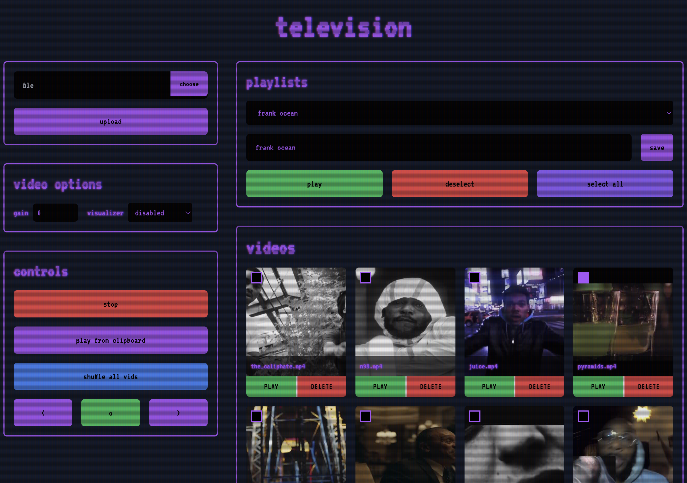

# Ambient CRT

**REQUIREMENTS:**

- VLC
- FFMPEG
- COMPUTER/PI/WHATEVER TO CONNECT TO OLD TV WITH AND HAVE RUNNING

I bought an old 90's CRT and I want it to basically play videos on loop in the background.\
This hosts a web server on the local network that lets you upload videos and play them with VLC on loop, an optionally on mute or with a visualizer.\
You then, can hook this up to the old CRT through various converters and it you should be able to leave the computer alone.

**FEATURES**:

- upload videos/delete from site
- play on loop
- playlist creation, on loop, filesystem persisted
- auto thumbnail generator
- custom gain & visualizer options
- automatically configured vlc with custom flag support (flag.txt)
- log to file / stdout
- okay web ui
- small/fast/reliable since rust

This is not secured in any way so don't expose it to the internet.

